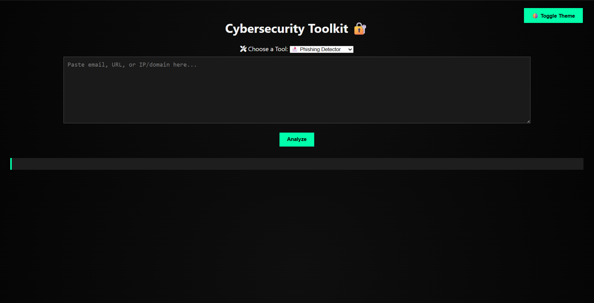

# 🛡️ Cybersecurity Toolkit 🔐

A voice-enhanced, dark-mode-friendly web app built with **Flask** for analyzing:

- 📩 Phishing Emails  
- 🌐 Suspicious URLs  
- 🛠️ Basic Vulnerability Port Scans  

Built with ❤️ using Python, HTML, CSS, and JavaScript.

---

## 🔍 Preview



---

## 🌐 Live Demo

[Click here to use the app](https://cyber-toolkit.onrender.com)

⚠️ First load may take 20–50 seconds due to free server cold start.


## 🚀 Features

- ⚡ Clean, responsive UI with light/dark mode toggle  
- 🔊 Voice alerts and greeting for accessibility and style  
- 🔐 Detect phishing phrases, suspicious URL patterns, and common open ports  
- 🎯 Minimal setup, perfect for demos, portfolios, or security labs  

---

## 🗂️ Project Structure

```
Cybersecurity-Toolkit/
├── app.py               # Main Flask app
├── phishing.py          # Phishing detection logic
├── url_scan.py          # URL scanning logic
├── vuln_scan.py         # Port scanner
├── requirements.txt     # Python dependencies
│
├── templates/
│   └── index.html       # Frontend HTML
│
└── static/
    ├── css/
    │   └── style.css    # Styles
    └── js/
        └── script.js    # JavaScript (theme, voice, fetch)
```


---

## 🛠️ Tech Stack

- **Frontend**: HTML, CSS, JavaScript  
- **Backend**: Python (Flask)  
- **Deployment**: Render  
- **Voice Feature**: Web Speech API (JS)

---

## 🧠 Modules

- `phishing.py`: Detects common phishing phrases in email text  
- `url_scan.py`: Scans for suspicious keywords or malformed URLs  
- `vuln_scan.py`: Scans basic open ports on given IP/domain  
- `script.js`: Handles analyze action, voice feedback, and theme toggle  

---

## 🧪 How to Run Locally

```bash
# 1. Clone the repo
git clone https://github.com/YOUR_USERNAME/YOUR_REPO_NAME.git

# 2. Navigate into the folder
cd YOUR_REPO_NAME

# 3. Install dependencies
pip install -r requirements.txt

# 4. Run the app
python app.py


Visit http://localhost:5000 in your browser.


